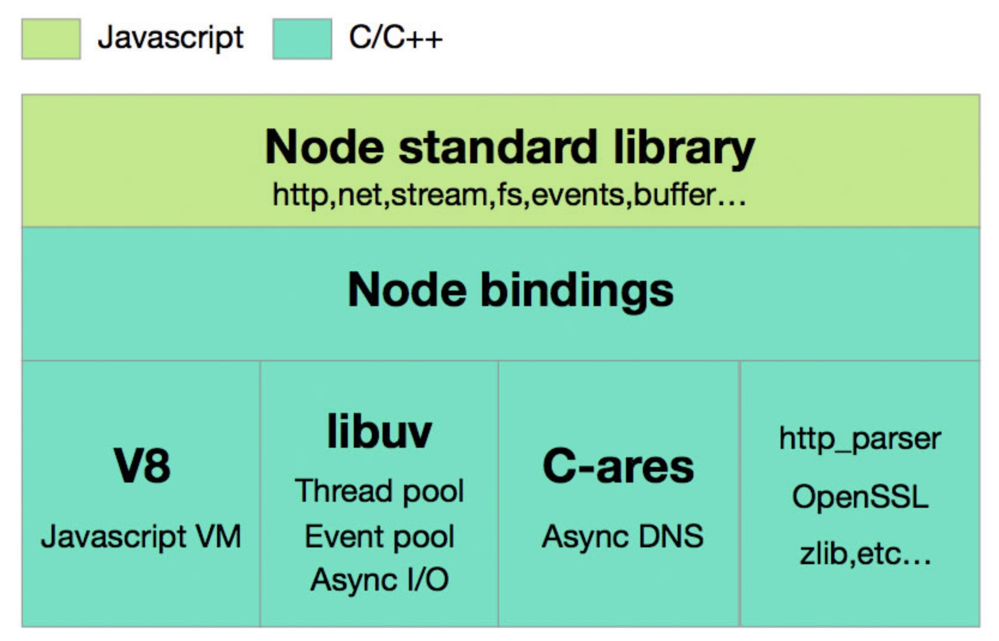
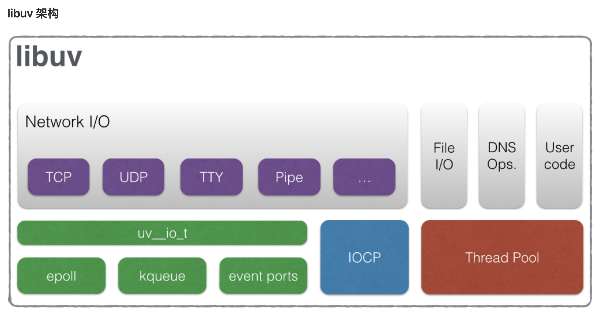

# Node 架构一览

## 架构图


- Node Standard library 为 node 官网提供的API调用库
- Node bindings 实现 API 结合 C++ 调用的中间层
- v8 javascript 虚拟机，提供javascript 执行环境
- libuv 实现文件I/O，提供事件循环机制。
- c-ares 提供异步处理DNS能力
- 其他提供包括 http 解析、SSL、数据压缩等其他的能力

## libuv 


网路请求 + 文件I/O + DNS 功能通讯 + 用户代码占用不同的消息机制。Network I/O相关的请求， 根据OS平台不同，分别使用Linux上的epoll，OSX和BSD类OS上的kqueue，SunOS上的event ports以及Windows上的IOCP机制。

## V8

```javascript
v8 === handle + scoped + context
```
v8 中变量存放到heap中。可以使用 [heapdump](https://www.npmjs.com/package/heapdump) 对内存进行快照。并分析当前运行时内存占用情况。handle 存放的是变量的引用。Handle 分为 Local（本地） 和 Persistent（全局） 两种。当handle存放的引用删除了，那么对应heap中变量就会被GC回收。

scoped 作用域。当一个函数体内执行完成后，GC开始回收函数内部变量，逐个回收显然么有通过作用域一次性回收效率高。

context 执行上下文。Context 可以嵌套，即当前函数有一个 Context，调用其它函数时如果又有一个 Context，则在被调用的函数中 javascript 是以最近的 Context 为准的，当退出这个函数时，又恢复到了原来的 Context。平行之间的context相对独立，互不影响。

```javascript
// 平行context
// a b 之间的context依赖当前共同执行环境，但是二者之间的执行环境不互相影响
function a () {
}
function b () {
}
```
