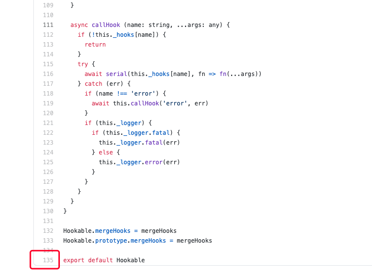
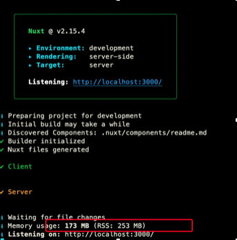
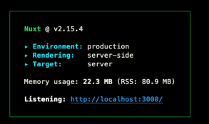
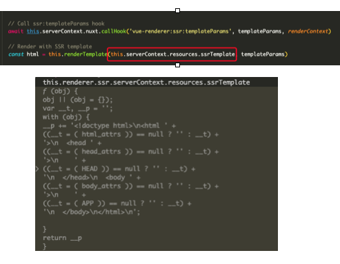

# Nuxt 源码体悟

## 模式

`Nuxt` 或者是 `Next` 都提供了三种模式，借此梳理了一下。

| 名称 | 优点 | 缺点 |
| :--- | :--- | :--- |
| SPA | 1. Javascript Framework\(vue/react/rn\)简化高度数据数据绑定，简化交互式应用程序的开发。&lt;/br&gt;2. 一次请求，后面不需要在重复请求资源。&lt;/br&gt;3. SPA 通过 API 推动数据与展示层的分离。 | 1. 包体积过大。&lt;/br&gt; 2. 不能很好的SEO。&lt;/br&gt; 3. 应用状由于都存放到内存中，大型应用状态复杂度较高。 |
| SSG | 1. 更好的SEO&lt;/br&gt; 2. 减少LCP的耗时。 | 1. 内容更新不及时。&lt;/br&gt;2. 定制类客户需求变得复杂。 |
| SSR | 1. 减少LCP的耗时&lt;/br&gt; 2. 内容更新及时 | 1. 带来服务器运维成本。&lt;/br&gt; 2. JS多环境运行对开发者全局变量使用有要求。 |

## 为什么选择Nuxt?

SSR 旨在用户请求访达时，首屏页面真实 DOM 早已从前端 Javascript Framework 中编译解析出来。从而浏览器渲染进程在渲染页面的时候，区别于 SPA, 不依赖 Javascript 解析。从而减少 LCP 的耗时。

但是，当用户行为的注册、监听的时间，比如用户点击行为。还是依赖 js 。而且，SSR 服务端渲染出页面后，页面如何进行跳转。同样是开发者需要考虑的问题。

开发部署阶段编译 → 路由表匹配模板 → 编译模板 + 打包工具输出JS → 生成页面返回 → http 用户请求 → koa 等server 拦截请求 → 路由表匹配模板 → 动态加载js

以上是 Nuxt SSR模式下的主要流程。为什么选择Nuxt，在我看来，他提供了一种方便，方便开发者在不考虑内部机制的情况下，快速实现APP应用的SSR模式。所以，他的SSR模式是主打功能，相对于SPA，个人觉得框架本身它的侧重点不在与此。

## Nuxt 编译阶段线性工作流

Nuxt 源码中，基类 Nuxt 继承一个NPM包，[Hable](https://www.npmjs.com/package/hable)。它贯穿整个 Nuxt 编译阶段的生命周期。Nuxt 官网中也有描述，它主要的功能对标 Webpack [Tapable](https://www.npmjs.com/package/tapable)。内部源码实现很好理解，一共不到200行代码。如图：  这里我浓缩了一下，代码如下：

```javascript
const cache = {};
function hook (name, fn) {
    if (!cache[name]) {
        cache[name] = [fn];
    } else {
        cache[name].push(fn);
    }
    return () => {
        if (fn) {
            console.log("==remove==");
        }
    }
} 
// 方法调用
hook('test1', () => {
    console.log("====待调用方法===");
})
hook('test2', () => {
    console.log("====待调用方法===");
})
```

```javascript
// 内部对 cache 缓存的方法进行顺序执行
function serial(task, fn) {
    return tasks.reduce((promise, task) => promise.then(() => fn(task)), Promise.resolve(null))
}
```

使用这样一个库的意义是保证 Nuxt 在编译阶段，各个部分都可以按照调用顺序执行，并且保证每一次的方法执行都基于上一次 Promise 的执行完成之后，从而形成编译阶段的线性工作流。

## Nuxt Server

Nuxt 本身提供三种启动方式。开发阶段本身的诉求就是，高效的HMR，项目实时预览。那么在Nuxt中，底层是用了 Webpack 作为开发编译阶段的工具。如下图对比可以所示：

 

第一张图运行时内存占用较大，是因为webpack在动态编译js时候，会把编译所形成的DSL存储在内存当中，方便模板修改后，对 DSL 的 diff。而第二张图，代表着 Nuxt 提供的生产模式下的 server 启动方式。其本质基于 Node HTTP + [Connect](https://www.npmjs.com/package/connect) 模块结合。

## Nuxt 各阶段梳理

### 1. 开发部署阶段编译

Nuxt 基于vue，所以在编模板时，理所应当的利用了`vue-template-complier` 以及 `vue-loader` 对文件进行编译。同时，vue 提供了 SSR 模式的 `renderToString()`将模板转换成这是 DOM 字符串。

### 2. 打包工具输出js

Nuxt 本身提供 Webpack + vue-loader 对模板进行编译、切割、解释、生成压缩文件。作为开发者，也可以结合自身去动完成。

### 3. 生成页面返回

`VueRender.renderer` 包含 \( `SpaRender` + `SsrRender` \)，两种模式被不通的Render方法所处理，处理过程中，结合 Nuxt.config.js 配置。生成完成的html字符串。输出到html中。



### 4. 路由表匹配实现页面切换

Nuxt 实现页面切换，主要是在编译解析路由的过程中，会生成不同的chunkName。chunkName 本身是和编译后的JS存在对应关系。所以当页面路由发生变化。Nuxt 会动态匹配并完成JS执行。


